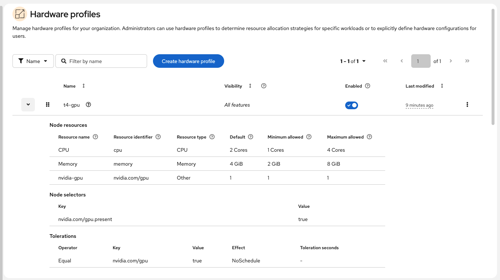

This guide shows how to add NVIDIA GPU capacity to an existing Red Hat OpenShift Service on AWS (ROSA) cluster and validate it for use with Red Hat OpenShift AI.

The flow in this guide covers:

* creating a GPU machine pool on ROSA
* installing Node Feature Discovery (NFD)
* installing the NVIDIA GPU Operator 
* creating a `ClusterPolicy`
* verifying that the GPU is exposed to the cluster
* enabling OpenShift AI hardware profiles
* creating a GPU-backed hardware profile and validating a GPU-enabled workbench

This guide was validated on ROSA 4.20 with OpenShift AI 2025.2 using an NVIDIA Tesla T4 GPU on an AWS `g4dn.xlarge` instance.


## 0. Prerequisites

Before you begin, make sure you have:

* an existing ROSA cluster with `cluster-admin` access
* the `rosa` CLI configured for your cluster
* the `oc` CLI configured and logged in
* sufficient AWS quota and capacity for a GPU instance type in your target Region and Availability Zone
* Red Hat OpenShift AI already installed if you want to validate GPU-backed workbenches from the dashboard

This walkthrough was validated on an existing ROSA cluster in `ca-central-1` using a `g4dn.xlarge` GPU machine pool.

## 1. Create a GPU machine pool

Start by creating a dedicated GPU machine pool instead of modifying existing worker pools. This keeps GPU workloads isolated and makes scheduling easier to reason about.

```bash
export CLUSTER=<your-cluster-name>
export GPU_MP_NAME=gpu
export GPU_INSTANCE_TYPE=g4dn.xlarge

rosa create machinepool \
  --cluster=$CLUSTER \
  --name=$GPU_MP_NAME \
  --replicas=1 \
  --instance-type=$GPU_INSTANCE_TYPE \
  --labels=node-role.kubernetes.io/gpu=,nvidia.com/gpu.present=true \
  --taints=nvidia.com/gpu=true:NoSchedule
```

The GPU machine pool can take several minutes to provision. Wait until the new node joins the cluster and the machine pool shows `1/1`.

```bash
rosa list machinepools -c $CLUSTER
oc get nodes
oc get nodes -L node-role.kubernetes.io/gpu
```

At this stage, the GPU node existed but did not yet advertise `nvidia.com/gpu`, because the GPU software stack had not yet been installed.


## 2. Install the Node Feature Discovery Operator

Install the Node Feature Discovery (NFD) Operator from OperatorHub. NFD is used to discover hardware capabilities and label nodes appropriately. OpenShift AI documentation still requires creating a `NodeFeatureDiscovery` instance after installing the operator. 

```bash
cat <<'EOF' | oc apply -f -
apiVersion: v1
kind: Namespace
metadata:
  name: openshift-nfd
---
apiVersion: operators.coreos.com/v1
kind: OperatorGroup
metadata:
  name: openshift-nfd
  namespace: openshift-nfd
spec:
  targetNamespaces:
  - openshift-nfd
---
apiVersion: operators.coreos.com/v1alpha1
kind: Subscription
metadata:
  name: nfd
  namespace: openshift-nfd
spec:
  channel: stable
  installPlanApproval: Automatic
  name: nfd
  source: redhat-operators
  sourceNamespace: openshift-marketplace
EOF
```

Wait for the operator to install:

```bash
oc get csv -n openshift-nfd -w
```

Create the `NodeFeatureDiscovery` instance:

```bash
cat <<'EOF' | oc apply -f -
apiVersion: nfd.openshift.io/v1
kind: NodeFeatureDiscovery
metadata:
  name: nfd-instance
  namespace: openshift-nfd
spec: {}
EOF
```

Verify the pods:

```bash
oc get nodefeaturediscovery -n openshift-nfd
oc get pods -n openshift-nfd
```

At this point, all NFD components should be in `Running` state.

## 3. Install the NVIDIA GPU Operator

After NFD is installed, install the NVIDIA GPU Operator. In this guide, the operators are installed with the CLI for repeatability and easy copy/paste. You can also install the same operators from Software Catalog (formerly known as OperatorHub) in the OpenShift web console if you prefer a UI-based workflow.

The current certified package in Software Catalog is `gpu-operator-certified`. NVIDIA’s OpenShift installation flow still centers on installing the operator and then creating a `ClusterPolicy`.

```bash
cat <<'EOF' | oc apply -f -
apiVersion: v1
kind: Namespace
metadata:
  name: nvidia-gpu-operator
---
apiVersion: operators.coreos.com/v1
kind: OperatorGroup
metadata:
  name: nvidia-gpu-operator
  namespace: nvidia-gpu-operator
spec:
  targetNamespaces:
  - nvidia-gpu-operator
---
apiVersion: operators.coreos.com/v1alpha1
kind: Subscription
metadata:
  name: gpu-operator-certified
  namespace: nvidia-gpu-operator
spec:
  channel: stable
  installPlanApproval: Automatic
  name: gpu-operator-certified
  source: certified-operators
  sourceNamespace: openshift-marketplace
EOF
```

Wait for the CSV:

```bash
oc get csv -n nvidia-gpu-operator -w
```

In this validation, the installed CSV was `gpu-operator-certified.v26.3.0`.

## 4. Create the `ClusterPolicy`

Create the `ClusterPolicy` using the operator-provided defaults:

```bash
oc get csv -n nvidia-gpu-operator gpu-operator-certified.v26.3.0 \
  -o jsonpath='{.metadata.annotations.alm-examples}' \
| jq -r '.[] | select(.kind=="ClusterPolicy")' > gpu-cluster-policy.json

cat gpu-cluster-policy.json
oc apply -f gpu-cluster-policy.json
```

Verify readiness:

```bash
oc get clusterpolicy
oc describe clusterpolicy gpu-cluster-policy
oc get pods -n nvidia-gpu-operator
```

The `gpu-cluster-policy` should reach `State: ready`.

## 5. Verify GPU capacity on the node

After the `ClusterPolicy` reconciles, verify that the GPU node exposes allocatable GPU resources.

```bash
oc get nodes -o json | jq '.items[] | {name: .metadata.name, gpu: .status.allocatable["nvidia.com/gpu"]}'
```

An example of expected output:

```json
{
  "name": "ip-10-0-1-224.ca-central-1.compute.internal",
  "gpu": "1"
}
```

The GPU node reported `nvidia.com/gpu: "1"` which means that the NVIDIA stack was working at the cluster level.

## 6. Validate the GPU with a simple pod

Before moving to OpenShift AI, validate the GPU with a simple test pod.

```bash
cat <<'EOF' | oc apply -f -
apiVersion: v1
kind: Pod
metadata:
  name: nvidia-smi
spec:
  restartPolicy: Never
  tolerations:
  - key: nvidia.com/gpu
    operator: Equal
    value: "true"
    effect: NoSchedule
  containers:
  - name: nvidia-smi
    image: nvcr.io/nvidia/cuda:12.5.0-base-ubi9
    command: ["/bin/bash","-lc","nvidia-smi && sleep 5"]
    resources:
      limits:
        nvidia.com/gpu: 1
EOF
```

Watch it and inspect the logs:

```bash
oc get pod nvidia-smi -w
oc logs nvidia-smi
```

In this validation, the pod moved from `ContainerCreating` to `Running` in a few seconds and then completed successfully. The `nvidia-smi` output showed a Tesla T4 and confirmed that the driver and CUDA stack were functioning correctly.

## 7. Enable OpenShift AI hardware profiles

To expose the newer hardware-profile workflow, enable hardware profiles in the `OdhDashboardConfig` custom resource. [OpenShift AI docs](https://docs.redhat.com/en/documentation/red_hat_openshift_ai_self-managed/2.25/html-single/working_with_accelerators/index) describe `disableHardwareProfiles=false` as the setting that shows **Settings -> Hardware profiles** in the dashboard. 

Patch the dashboard config:

```bash
oc patch odhdashboardconfig odh-dashboard-config \
  -n redhat-ods-applications \
  --type merge \
  -p '{
    "spec": {
      "dashboardConfig": {
        "disableHardwareProfiles": false
      }
    }
  }'
```

Optional verification:

```bash
oc get odhdashboardconfig odh-dashboard-config \
  -n redhat-ods-applications -o yaml | egrep -n 'disableHardwareProfiles|disableAcceleratorProfiles'
```

After this change and a page refresh, the dashboard displayed **Settings -> Hardware profiles** and the workbench form switched to the hardware-profile-based UI.

## 8. Create a GPU hardware profile in OpenShift AI

The default hardware profiles that appear in the dashboard, such as Small, Medium, Large, and X Large, are CPU and memory profiles only. They do not automatically request a GPU. Create a dedicated GPU hardware profile for the workbench from **Settings -> Hardware profiles**. 

These are the hardware profile settings validated in this guide: 

> * **Name:** `t4-gpu`
>
> * **Visibility:** Visible everywhere
>
> * **Additional resource:**
>   * Resource name: `nvidia-gpu`
>   * Resource identifier: `nvidia.com/gpu`
>   * Resource type: `Other`
>   * Default: `1`
>   * Minimum allowed: `1`
>   * Maximum allowed: `1`
>
> * **Node selector:**
>   * Key: `nvidia.com/gpu.present`
>   * Value: `true`
>
> * **Toleration:**
>   * Key: `nvidia.com/gpu`
>   * Operator: `Equal`
>   * Value: `true`
>   * Effect: `NoSchedule`

Once created, the hardware profile should look like this:


<br />

## 9. Create and validate a GPU-backed workbench

After you create the GPU hardware profile, return to your data science project and create a new workbench using that profile.

Wait until the status is `Running` per snippet below:


<br />

To verify where the workbench landed and what resources it requested, inspect the pod:

```bash
oc get pods -n project-gpu -o wide

oc get pod -n project-gpu project-gpu-workbench-0 -o yaml | egrep -n "nvidia.com/gpu|nodeSelector|tolerations"
```

At this stage, the workbench pod should:

* runs on the GPU node
* requests `nvidia.com/gpu: "1"`
* uses `nodeSelector: nvidia.com/gpu.present: "true"`
* includes a toleration for `nvidia.com/gpu=true:NoSchedule`

Finally, open a terminal in the running workbench and confirm that the GPU is available:

```bash
nvidia-smi
```


<br />

As seen from the above output, `nvidia-smi` inside the workbench showed an NVIDIA Tesla T4, confirming that the workbench had end-to-end GPU access through OpenShift AI.
